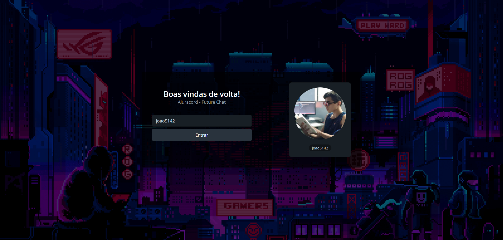
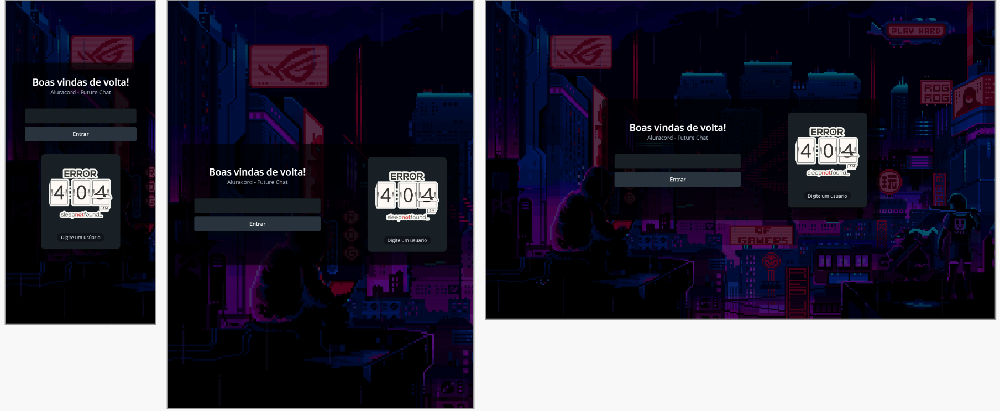

<h1>Aluracord Future Chat</h1>
<h4>Projeto desenvolvido na imersão react da Alura com HTML|CSS|Javascript</h4>
<h2>Tecnologias Utilizadas</h2>

  
  
  
 

<h2>Preview</h2>

<h4  style="display: inline_block">Visualização do site :</h4><a style="display: inline_block" target="blank" href="https://alura-matrix-i8fsomazl-joao5142.vercel.app/">Preview no Vercel</a>

